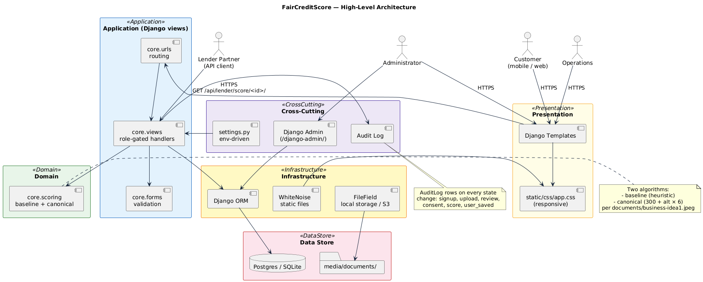
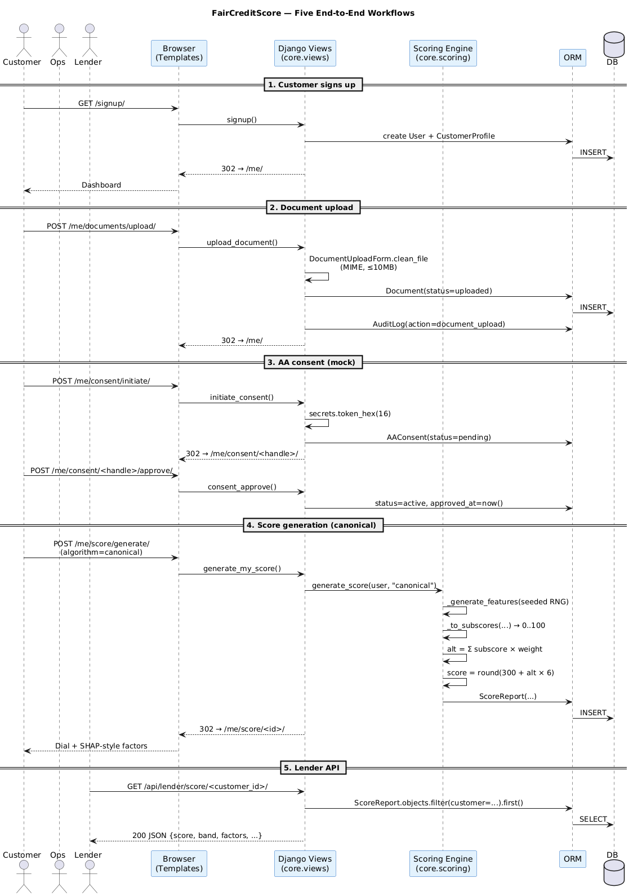
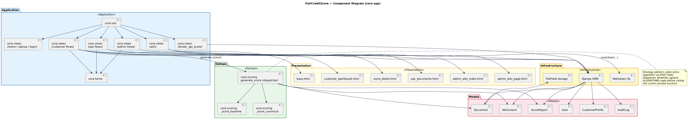
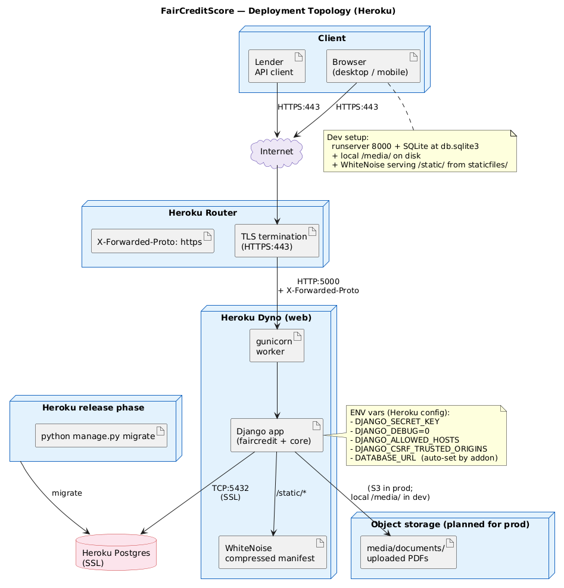

# FairCreditScore — System Architecture

## 1. Introduction

### 1.1 Purpose
This document describes the system architecture of the FairCreditScore
prototype: a Django + Postgres-ready alternative credit scoring platform
that produces a 300–900 score from synthetic (today) or real Account
Aggregator (planned) data. It is the canonical engineering reference for
the prototype as of PI-1.

### 1.2 Scope
Covers the customer, operations, and administrator web flows; the
FairCreditAI scoring engine (baseline + canonical); the Account
Aggregator consent state machine (mocked); the lender API; the admin
wiki; and the deployment posture (Heroku-friendly).

### 1.3 Intended audience
Engineers extending the platform, ops/security reviewers, NBFC anchor
technical leads, and prospective lender partners doing due diligence.

### 1.4 Document conventions
- Code paths are repo-relative (e.g. `core/scoring.py`).
- Diagrams live in `diagrams/` as PlantUML `.puml` source.
- Tables list contractual surfaces; prose explains behaviour.

---

## 2. System Overview

FairCreditScore is a Django web application with three role-gated
portals (customer, operations, administrator), a synthetic FairCreditAI
scoring engine, a mock Setu Bridge AA consent flow, an admin wiki for
the repo's `documents/` folder, and a JSON lender API.



### 2.1 High-level architecture (layers)

| Layer | Implemented by | Responsibility |
|---|---|---|
| Presentation | Django templates + `static/css/app.css` | Server-rendered HTML, mobile-responsive |
| Application (views) | `core/views.py` | Role gating, request orchestration, audit emission |
| Domain | `core/scoring.py`, `core/forms.py` | Scoring math, validation |
| Infrastructure | `core/models.py`, Django ORM, FileField storage | Persistence, file uploads |
| Cross-cutting | `core/admin.py`, `AuditLog`, settings, middleware | Admin tooling, telemetry, security headers |
| Data store | SQLite (dev) / Postgres (prod) | Users, profiles, documents, consents, scores, audit |

### 2.2 Quality attributes

| Attribute | How addressed |
|---|---|
| Security | Django auth + custom role checks, CSRF on every form, traversal-safe wiki, X-Forwarded-Proto trust on Heroku |
| Performance | Synthetic scoring runs in ~1 ms; markdown rendering ≤ 50 ms per wiki page |
| Maintainability | Single Django app (`core`), explicit role decorators, small modules |
| Portability | Postgres-ready settings + WhiteNoise for static = deployable on any 12-factor host |
| Accessibility | Mobile-first responsive (320 px+), 16 px form inputs (no iOS zoom), keyboard-navigable forms |

---

## 3. Architectural Design

### 3.1 Style — Django MTV (Model · Template · View)
Pure server-rendered HTML; no SPA. The custom `User` model and the
`@admin_required`/`@ops_required`/`@customer_required` decorators
implement role-based access. `AuditLog` rows capture every meaningful
state change.

### 3.2 Design patterns

| Pattern | Where | Why |
|---|---|---|
| Strategy | `core/scoring.py::generate_score(algorithm=...)` | Two scoring algorithms (baseline / canonical) selectable per request |
| Decorator | `customer_required`, `ops_required`, `admin_required` | Role gating without leaking to URLs |
| Repository (light) | Django ORM querysets in views | Persistence cleanly separated from domain math |
| Idempotent state machine | `AAConsent` (`pending → active → revoked/expired`), `Document` (`uploaded → verified/rejected`) | Predictable flow, safe to retry |
| Audit log | `core.models.AuditLog` + `_audit()` helper in views | Forensic trail for ops + admin |



### 3.3 Data flow narrative

1. Customer POSTs `/signup/` → `signup` view creates `User` + `CustomerProfile`, logs in, redirects to `/me/`.
2. Customer uploads PAN PDF on `/me/documents/upload/` → `Document(status=uploaded)` row + file in `media/`.
3. Customer initiates AA consent on `/me/consent/initiate/` → 32-char handle + `AAConsent(status=pending)`.
4. Customer approves consent → `AAConsent(status=active)`.
5. Customer clicks "Generate my score" → `generate_score` called with `algorithm=baseline|canonical`. Engine reads consent + verified-doc counts (baseline only), produces `ScoreReport`.
6. Customer views `/me/score/<id>/`, sees the dial + SHAP-style factors.
7. Operations user reviews uploaded documents, approves/rejects with notes.
8. Lender partner GETs `/api/lender/score/<customer_id>/` → JSON.
9. Admin browses `/admin-portal/wiki/<file.md>` → server renders markdown.

### 3.4 API surface (browser-facing)

| Method | Path | Role | Purpose |
|---|---|---|---|
| GET | `/` | public | Landing page |
| GET | `/signup/` | public | Sign-up form |
| POST | `/signup/` | public | Create customer account |
| GET | `/login/` | public | Login form |
| POST | `/login/` | public | Authenticate |
| POST | `/logout/` | any | Sign out |
| GET | `/me/` | customer | Dashboard |
| GET/POST | `/me/profile/` | customer | Edit profile |
| GET/POST | `/me/documents/upload/` | customer | Upload doc |
| POST | `/me/consent/initiate/` | customer | Start AA consent |
| GET | `/me/consent/<handle>/` | customer | Review consent |
| POST | `/me/consent/<handle>/approve/` | customer | Approve consent |
| POST | `/me/consent/<handle>/revoke/` | customer | Revoke consent |
| POST | `/me/score/generate/` | customer | Generate score (algorithm=baseline\|canonical) |
| GET | `/me/score/<pk>/` | customer | Score detail |
| GET | `/ops/` | ops/admin | Ops dashboard |
| GET | `/ops/documents/?status=` | ops/admin | Doc queue |
| POST | `/ops/documents/<pk>/review/` | ops/admin | Approve/reject doc |
| GET | `/ops/customers/?q=` | ops/admin | Customer search |
| GET | `/ops/customers/<pk>/` | ops/admin | Customer detail |
| GET | `/admin-portal/` | admin | Admin dashboard |
| GET | `/admin-portal/users/` | admin | User list |
| GET/POST | `/admin-portal/users/new/` | admin | Create user |
| GET/POST | `/admin-portal/users/<pk>/edit/` | admin | Edit user |
| GET | `/admin-portal/audit/` | admin | Audit trail |
| GET | `/admin-portal/wiki/` | admin | Wiki root |
| GET | `/admin-portal/wiki/<path>` | admin | Wiki node (dir or file) |
| GET | `/admin-portal/wiki/raw/<path>` | admin | Raw download |
| GET | `/django-admin/` | admin/superuser | Django admin |

### 3.5 API surface (machine-facing, lender)

| Method | Path | Auth | Returns |
|---|---|---|---|
| GET | `/api/lender/score/<customer_id>/` | none in prototype | `{customer_id, username, score, band, recommended_loan_amount, top_positive_factors, top_negative_factors, generated_at}` |

> **Production hardening:** add API-key auth, signed requests, and rate limits before any partner integration.

---

## 4. System Components



### 4.1 Component reference (see `diagrams/03_component_diagram.puml`)
The application is a single Django app, `core`, organised into the
following responsibilities. The component diagram in
`diagrams/03_component_diagram.png` shows their dependency arrows.

### 4.2 Data models

| Model | Key fields | Description |
|---|---|---|
| `User` (extends `AbstractUser`) | `role`, `mobile`, `pan` | Custom user with role enum (admin / ops / customer) |
| `CustomerProfile` | `user (1-1)`, `full_name`, `monthly_income`, `aadhaar_last4` | Per-customer profile data |
| `Document` | `customer`, `doc_type`, `file`, `status`, `reviewed_by`, `notes` | Uploaded ID/income document |
| `AAConsent` | `customer`, `handle (unique)`, `aa_provider`, `fi_types`, `status`, `approved_at`, `revoked_at` | AA consent artifact |
| `ScoreReport` | `customer`, `algorithm`, `score`, `band`, 7 feature floats, `top_positive_factors` (JSON), `top_negative_factors` (JSON), `recommended_loan_amount` | Generated FairCreditScore record |
| `AuditLog` | `actor`, `action`, `target`, `detail`, `timestamp` | Append-only audit trail |

### 4.3 Service layer

- `core/scoring.py` — synthetic feature generator + two algorithm
  implementations. Public dispatcher
  `generate_score(customer, algorithm)`.
- `core/forms.py` — Django forms with input validation (10 MB cap,
  PDF/JPG/PNG only).
- `core/views.py` — request handlers using forms + ORM, emitting
  `AuditLog` rows on every state change via `_audit()`.

### 4.4 Matching / resolution logic
- Path traversal in the wiki is mitigated by `_wiki_safe_path()`, which
  resolves the candidate to absolute, then verifies it is still under
  `WIKI_ROOT` (`Path.relative_to`).
- Document review enforces a fixed decision vocabulary
  (`approve`/`reject`); anything else is rejected with a flash message.

---

## 5. Deployment Architecture



See `diagrams/04_deployment_diagram.puml`.

### 5.1 Runtime requirements

| Component | Version |
|---|---|
| Python | 3.11+ |
| Django | 5.1.x |
| Postgres | 14+ (production) / SQLite (dev) |
| Static asset server | WhiteNoise (CompressedManifestStaticFilesStorage) |
| WSGI | gunicorn |
| Java (optional) | for rendering PlantUML diagrams to PNG |

### 5.2 Environment configuration

| Variable | Purpose | Default |
|---|---|---|
| `DJANGO_SECRET_KEY` | Cookie/CSRF secret | dev placeholder |
| `DJANGO_DEBUG` | Debug flag | `1` (dev) |
| `DJANGO_ALLOWED_HOSTS` | Comma-separated host list | `*` |
| `DJANGO_CSRF_TRUSTED_ORIGINS` | Comma-separated origins | empty |
| `DATABASE_URL` | Postgres URL (Heroku) | unset → SQLite fallback |
| `DATABASE_SSL` | Require SSL on Postgres | `1` |
| `POSTGRES_DB` / `POSTGRES_USER` / … | Local Postgres without `DATABASE_URL` | unset |

### 5.3 Deployment steps (Heroku)

```bash
heroku create your-app-name
heroku addons:create heroku-postgresql:essential-0
heroku config:set \
  DJANGO_SECRET_KEY="$(python -c 'import secrets; print(secrets.token_urlsafe(50))')" \
  DJANGO_DEBUG=0 \
  DJANGO_ALLOWED_HOSTS=your-app-name.herokuapp.com \
  DJANGO_CSRF_TRUSTED_ORIGINS=https://your-app-name.herokuapp.com
git push heroku claude/review-readme-start-SpWBu:main
heroku run python manage.py seed_demo
```

`Procfile` runs `migrate` in the release phase and boots gunicorn for
`web`. WhiteNoise serves static files. `runtime.txt` pins Python to
`3.11.15`.

---

## 6. Security Architecture

### 6.1 Authentication & authorisation
- Django session auth with `AUTH_USER_MODEL = "core.User"`.
- Three custom decorators wrap every view:
  - `@customer_required` — only `role=customer`.
  - `@ops_required` — `role=ops` or admin.
  - `@admin_required` — `role=admin` or superuser.
- Vanilla Django admin (`/django-admin/`) requires `is_staff=True`.

### 6.2 Data isolation rules
- Customer querysets filter on `customer=request.user` for documents,
  consents, score reports.
- Ops users see all customers but cannot edit user roles.
- Admin users can edit any user but cannot impersonate without going
  through `set_password`.

### 6.3 Input validation
- `DocumentUploadForm.clean_file` enforces MIME (PDF/JPG/PNG) and 10 MB
  cap.
- Django CSRF middleware on every state-changing form; logout uses POST
  per Django 5 default.
- `secrets.token_hex(16)` for AA consent handles → 128 bits of entropy.

### 6.4 Data protection
- Wiki path traversal blocked (Section 4.4).
- `SECURE_PROXY_SSL_HEADER = ("HTTP_X_FORWARDED_PROTO", "https")` so
  Django respects Heroku's TLS termination.
- `DJANGO_CSRF_TRUSTED_ORIGINS` env var lets prod set `https://your-app`.
- File uploads stored under `media/documents/YYYY/MM/`. For production
  swap to S3 / Cloud Storage with signed URLs.

---

## 7. Testing Strategy

### 7.1 Coverage targets

| Module | Target |
|---|---|
| `core/scoring.py` | 90 %+ unit (both algorithms, edge cases) |
| `core/forms.py` | 80 %+ (validation rules) |
| `core/views.py` | 70 %+ (one happy + one denial test per role gate) |
| `core/models.py` | smoke (transitions only) |

### 7.2 Recommended stack
- `pytest-django` for tests.
- `factory_boy` for User / CustomerProfile / Document factories.
- `pytest --cov=core --cov-report=term-missing` for coverage.

### 7.3 Test commands

```bash
pip install pytest-django factory_boy
pytest -q
pytest --cov=core --cov-report=html
```

---

## 8. Scalability & Performance

### 8.1 Per-operation estimates (SQLite, dev laptop)

| Operation | Latency |
|---|---|
| Score generation (synthetic, baseline) | ~1 ms |
| Score generation (synthetic, canonical) | ~1 ms |
| Wiki markdown render (BRD-v4, ~12 kB) | <30 ms |
| Document upload (5 MB PDF) | dominated by network I/O |

### 8.2 Database indexing notes
- Foreign keys (`customer`, `actor`, `reviewed_by`) get implicit indexes.
- `AAConsent.handle` is `unique=True` → indexed.
- For production add an index on `Document(status, uploaded_at)` to
  speed the ops review queue.

### 8.3 Frontend notes
- Single CSS file (~7 kB compressed) served via WhiteNoise compressed
  manifest.
- No JavaScript bundles; one inline `onclick` for the mobile menu.

---

## 9. Monitoring & Observability

### 9.1 Logging events

| Event | Level | Description |
|---|---|---|
| signup | INFO | New customer created |
| profile_update | INFO | Profile fields changed |
| document_upload | INFO | Document uploaded by customer |
| document_approve / document_reject | INFO | Ops decision recorded |
| consent_initiated / consent_approved / consent_revoked | INFO | AA consent state transitions |
| score_generated | INFO | Score row created with algorithm + value |
| user_saved | INFO | Admin created/edited a user |

All events flow into `AuditLog` and appear at `/admin-portal/audit/`.

### 9.2 Health checks
For production add:
```python
# core/views.py
def health(request):
    return JsonResponse({"status": "ok"})
```
and route `/health/` so Heroku can probe.

### 9.3 Metrics (suggested for production)
- `score_generation_duration_seconds` (histogram, label=`algorithm`).
- `documents_pending_total` (gauge).
- `consents_active_total` (gauge).
- `lender_api_requests_total` (counter, label=`status`).

Push to Prometheus / Heroku Metrics; alert on pending-doc backlog and
lender-API 5xx rate.

---

## 10. Diagrams

The four diagrams referenced above live in `diagrams/`:

- `01_high_level_architecture.puml` / `.png` — layered architecture
- `02_sequence_diagram.puml` / `.png` — five end-to-end workflows
- `03_component_diagram.puml` / `.png` — modules + dependencies
- `04_deployment_diagram.puml` / `.png` — runtime topology (Heroku)

To render:

```bash
curl -L -o /tmp/plantuml.jar \
  https://github.com/plantuml/plantuml/releases/download/v1.2024.8/plantuml-1.2024.8.jar
java -jar /tmp/plantuml.jar -tpng -o docs/FairCreditScore_Architecture/diagrams/ \
  docs/FairCreditScore_Architecture/diagrams/*.puml
```

Embed in this doc with:
```


```
