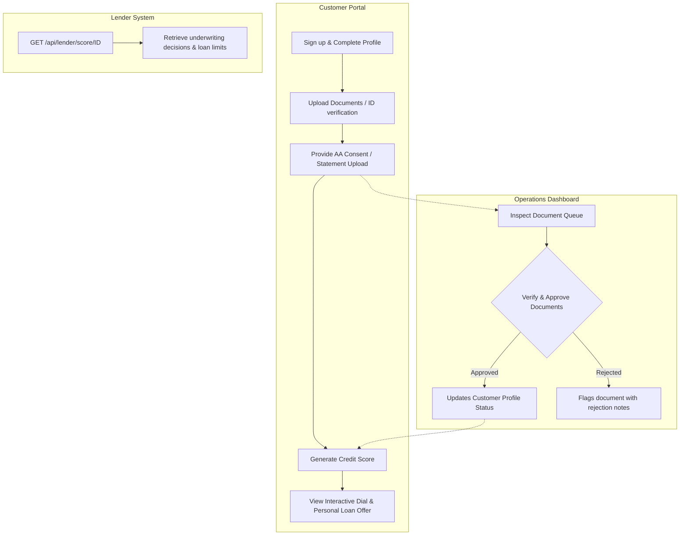

# FairCreditScore — Pitch Deck & Core Walkthrough

This document outlines the presentation slide deck for stakeholders, investors, and developers, detailing the application logic, operational workflows, and the ML/underwriting engine.

---

## Slide 1: Title & The Vision
### **FairCreditScore: Alternative Credit Scoring for India**
*Democratizing credit access for underserved, UPI-active borrowers using non-traditional digital footprints.*

* **The Problem**: Traditional credit scoring heavily relies on formal credit history, locking out millions of creditworthy gig-workers, kirana shop owners, and low-income salaried individuals who transact digitally but have no credit cards or formal loans.
* **The Solution**: An alternative credit scoring platform that builds a comprehensive financial profile using bank statement parsers and Account Aggregator consent flows.
* **The Pitch Target**: Underwrite and size loans automatically using transactional cashflow data, transaction diversity, and payment discipline.

---

## Slide 2: Core Business & Technical Logic
### **Alternative Data Inputs: The Seven Pillars**
*Instead of credit history, our engine maps seven behavioral parameters into normalized sub-scores ($0$ to $100$) to evaluate financial health.*

| Parameter | Weight | What it Evaluates | Target Metric |
| :--- | :---: | :--- | :--- |
| **Income Consistency** | `25%` | Inflow regularity and monthly stability | Frequency and size of credits |
| **Expense / Income Ratio** | `20%` | Operational overhead and burn rate | Lower ratio is better ($<60\%$) |
| **Savings Ratio** | `15%` | Net monthly residual funds | Target $>20\%$ of monthly net income |
| **Payment Timeliness** | `15%` | Punctuality of recurring utility/rent bills | Zero late payment penalties |
| **Transaction Frequency** | `10%` | Engagement in digital transaction ecosystems | $>100$ transactions per month |
| **Bounce Rate** | `10%` | Involuntary mandate (ECS/NACH) or cheque failures | Near-zero bounces ($0$ is ideal) |
| **Digital Engagement** | `5%` | Digital traceability and merchant diversity | UPI/IMPS counterparty breadth |

---

## Slide 3: Application Workflows & User Journeys
### **End-to-End Operational Lifecycle**
*A seamless, three-tier user experience connecting borrowers, operations reviewers, and lending partners.*



---

## Slide 4: ML, Scoring, & Underwriting Engine
### **Alternative Underwriting & Knockout Rules**
*The AI Model Engine converts cashflow data into loan offers using standard policies and knockout parameters.*

#### 1. Underwriting Decision Tiers
* **Grade A ($\ge 85$ score)**: Low Risk | $10.5\%$ Interest Rate | $8.0\times$ Income Multiplier
* **Grade B ($\ge 70$ score)**: Low Risk | $12.0\%$ Interest Rate | $6.0\times$ Income Multiplier
* **Grade C ($\ge 55$ score)**: Medium Risk | $14.5\%$ Interest Rate | $4.0\times$ Income Multiplier
* **Grade D ($\ge 40$ score)**: High Risk | $18.0\%$ Interest Rate | $2.0\times$ Income Multiplier (Manual Review)
* **Grade E ($< 40$ score)**: High Risk | **REJECTED**

#### 2. Knockout (KO) Parameters
Applications are instantly rejected (Decision: `REJECTED`) if they trigger any of the following guardrails:
* **Insufficient History**: Under $180$ days of transaction history.
* **Repayment Failures**: $\ge 3$ mandate/ECS or cheque bounces.
* **Fraud Check**: $>40\%$ of credits are internal self-transfers.
* **Negative Surplus**: Negative cashflow or expenses exceeding stable income.

---

## Slide 5: Platform Architecture & Integration Path
### **Technological Foundation & Live Sandbox Scaling**
*Robust, lightweight, and engineered for rapid progression from simulated prototype to live execution.*

* **Current Architecture**: Django 5.1, custom role decorators (`customer_required`, `ops_required`, `admin_required`), append-only AuditLog trail, and an inline Markdown wiki.
* **Consent Simulation**: Currently runs on a mock Setu Bridge flow using a 32-character secure handle and simulated approval OTP (`123456`).
* **Live Integration Pipeline**:
  ```
  [Setu Sandbox Credentials]
              │
              ▼
  [Implement SetuClient API Calls] ──► POST /Consent (Initiation)
              │
              ▼
  [Webhook Notification Listener]  ──► GET /Consent (Status update)
              │
              ▼
  [Fetch FI Data & Run Engine]     ──► Store parsed features
  ```
